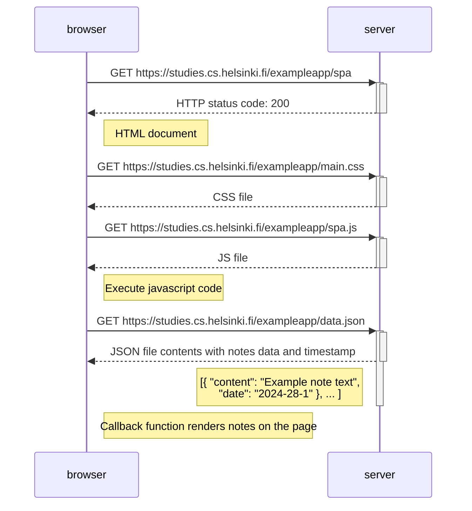

```mermaid

sequenceDiagram
    participant browser
    participant server

    browser->>+server: GET https://studies.cs.helsinki.fi/exampleapp/spa

    activate server
    server-->>-browser: HTTP status code: 200
    deactivate server

    Note right of browser: HTML document

    browser->>+server: GET https://studies.cs.helsinki.fi/exampleapp/main.css
    activate server
    server-->>-browser: CSS file
    deactivate server

    browser->>+server: GET https://studies.cs.helsinki.fi/exampleapp/spa.js
    activate server
    server-->>-browser: JS file
    deactivate server

    Note right of browser: Execute javascript code

    browser->>+server: GET https://studies.cs.helsinki.fi/exampleapp/data.json
    activate server
    server-->>-browser: JSON file contents with notes data and timestamp
    Note left of server: [{ "content": "Example note text",<br> "date": "2024-28-1" }, ... ]
    deactivate server

    Note right of browser: Callback function renders notes on the page

```