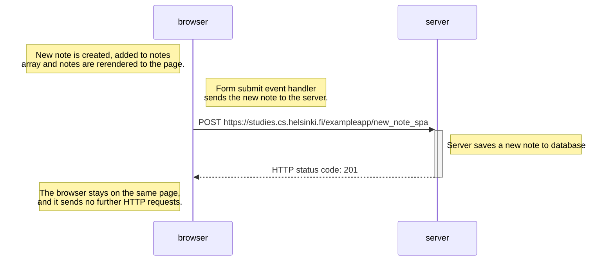

```mermaid

sequenceDiagram
    participant browser
    participant server

    Note left of browser: New note is created, added to notes <br> array and notes are rerendered to the page.
    Note right of browser: Form submit event handler <br> sends the new note to the server.

    browser->>+server: POST https://studies.cs.helsinki.fi/exampleapp/new_note_spa

    activate server
    Note right of server: Server saves a new note to database    
    server-->>-browser: HTTP status code: 201
    deactivate server
    
    Note left of browser: The browser stays on the same page, <br> and it sends no further HTTP requests.

```